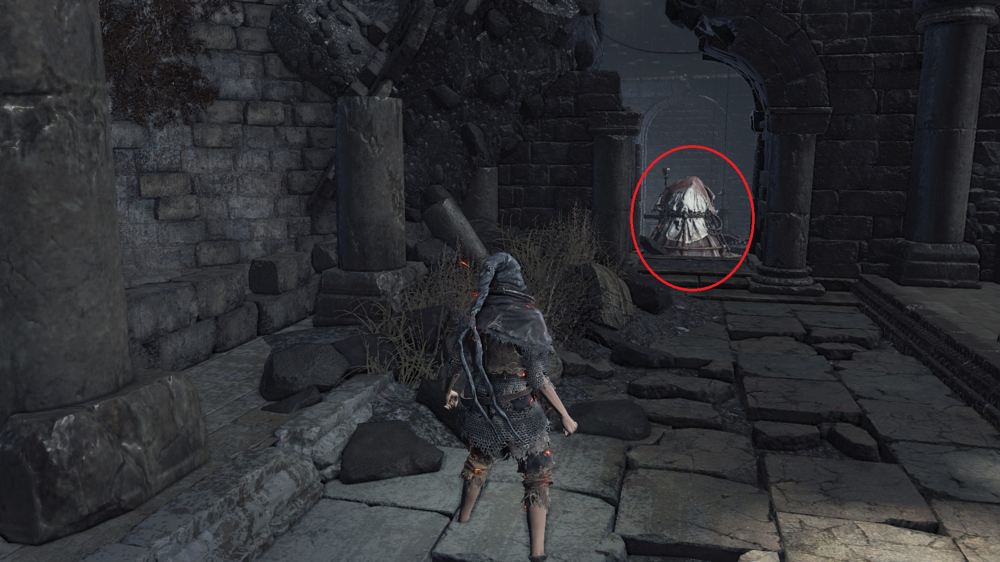

# Mendicant's Staff

The Mendicant's Staff allows you to absorb 20% more souls from defeated enemies.
You still receive the percentage bonus even if you do not have the stats
required to wield the weapon. The percentage bonus is fixed and upgrading the
staff does not increase the number. However, the Mendicant's Staff can be
stacked with the Silver Serpent Ring(+0,+1,+2,+3), Symbol of Avarice, and Shield
of Want. The staff can be farmed from the Man-Serpent Summoners in Archdragon
Peak, but the item is a rare drop.

To prepare for the farming in NG+0, ensure you have collected the Gold Serpent
Ring+0 in Irithyll Dungeon, transpose the Soul of a Crystal Sage into a Crystal
Sage's Rapier, and have collected as many Rusted Gold Coins as you can
throughout your playthrough. The easiest way to farm for the Mendicant's Staff
is from the Man-Serpent Summoner near the Great Belfry bonfire. Equip the Gold
Serpent Ring+0, Symbol of Avarice, Crystal Sage's Rapier in the left hand, and a
hard-hitting weapon in the right hand. Backup your game file "DS30000.sl2" as
per the methods shown in the thread below. Pop a Rusted Gold Coin and kill the
Man-Serpent Summoner as quickly as possible before it has a chance to summon
Prince Ricard. You might have to sit at the bonfire and repeat the process many
times for the staff to show up. If you exhausted your supply of Rusted Gold
Coins without getting the staff, load your backup and try again.

https://steamcommunity.com/app/374320/discussions/0/2152098843861775918/


