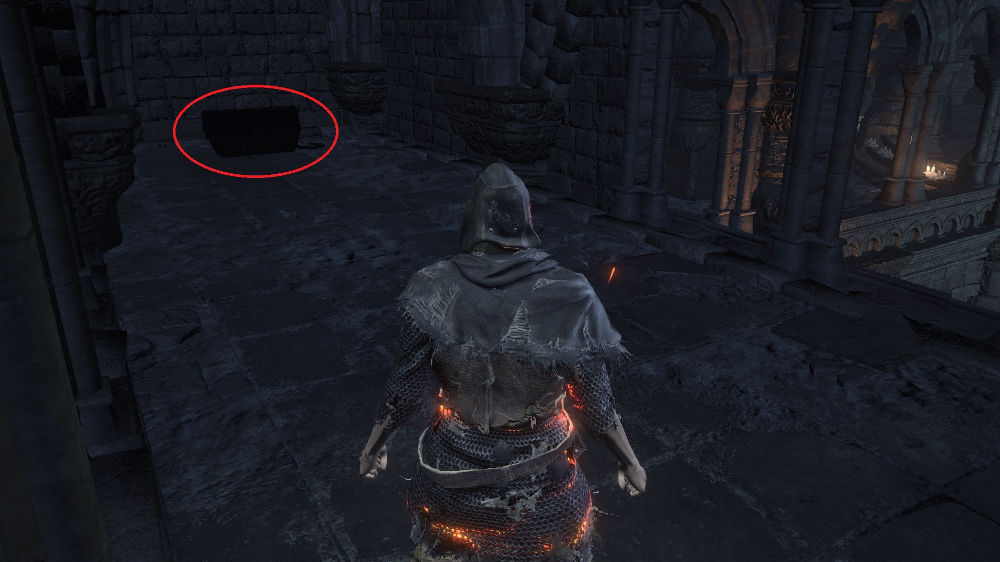

# Covetous Silver Serpent Ring

The Silver Serpent Ring allows you to absorb at least 10% more souls from
defeated enemies. Four variations of this ring exist, each giving you a higher
percentage bonus than the previous version:

-   +0: 10%, NG+0, Firelink Shrine
-   +1: 20%, NG+1, Irithyll Dungeon
-   +2: 30%, NG+2, Undead Settlement
-   +3: 35%, NG+0, Dreg Heap

Each version of the ring cannot be stacked with any other version. However, each
version can be stacked with the Symbol of Avarice, Shield of Want, and
Mendicant's Staff. As soon as you arrive at Firelink Shrine, you can perform the
tree jump to access the area where the Silver Serpent Ring+0 is located. The +1
and +2 versions are found in NG+1 and NG+2, respectively. If you have the Ringed
City DLC, you can acquire the +3 version in NG+0 from the Dreg Heap. You can
obtain both the +0 and +3 versions in NG+0. Unless you want to obtain all rings
for the Master of Rings achievement, you do not require the +1 and +2 versions
for farming souls.








