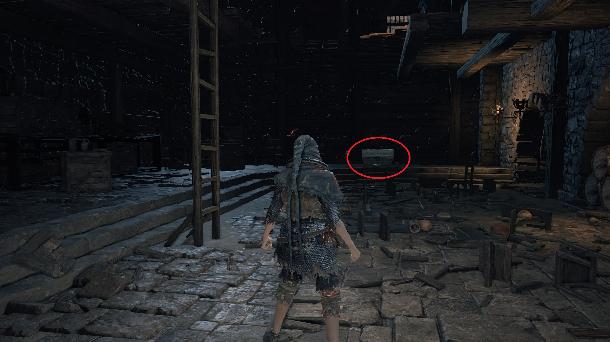

# Symbol of Avarice

The Symbol of Avarice allows you to absorb 50% more souls from defeated enemies
and also adds 100 points to your Item Discovery. The percentage soul bonus
stacks with the Silver Serpent Ring(+0,+1,+2,+3), Shield of Want, and
Mendicant's Staff. If you equip the Gold Serpent Ring+3 as well as the Symbol of
Avarice, both would boost your Item Discovery but the stacking is multiplicative
rather than additive, resulting in an extra point added to your Item Discovery.

The earliest part of the game at which you can farm for the Symbol of Avarice is
at the High Wall of Lothric, the second area of the game after Cemetery of Ash.
At this early in the game, farming for the Symbol of Avarice depends on your
Luck stat, which contributes to your Item Discovery. Depending on your starting
class, you start off with from 7 to 14 Luck. The Knight and Pyromancer starting
classes each has 7 Luck, while the Thief starting class alone has 14 Luck.



You can also boost your Item Discovery by using Rusted Coins and Rusted Gold
Coins. At this early in the game, you won't be able to purchase an unlimited
supply of Rusted Coins so it is usually recommended that you backup your save
file "DS30000.sl2" before you start farming. To make a backup of your save file,
this thread might help:

https://steamcommunity.com/app/374320/discussions/0/2152098843861775918/



You also require an Undead Hunter Charm to make any mimic sleep. Two Undead
Hunter Charms are found on a corpse in a giant pot at the High Wall of Lothric.
You won't be able to purchase any Undead Hunter Charms until you have given the
Paladin's Ashes to the Shrine Handmaid. Before you farm a mimic for the Symbol
of Avarice, backup your save file. Pop a Rusted (Gold) Coin, throw an Undead
Hunter Charm at the mimic, and wait approximately 10 seconds for a shiny to
appear. After 10 seconds or so, if a shiny doesn't appear or you haven't got a
Symbol of Avarice yet, hit the mimic with your bare fist so as not to kill it.
Throw another Undead Hunter Charm and/or pop another Rusted (Gold) Coin. Rinse
and repeat until you have exhausted your supply of Undead Hunter Charm. If this
process is unsuccessful, load your backup and try again.

After you have successfully farmed the Symbol of Avarice, equipping this item
would drain your HP by 10 points per tick. Early in NG+0 when your character
doesn't have the necessary spells and items to regenerate your HP, the Blessed
Red and White Shield+1 found in the Undead Settlement is your only option for HP
regeneration. A Blessed infused weapon can be used to regenerate your HP at a
rate of 3 HP per tick. A +0 Blessed infused weapon regenerates HP every 4
seconds. Upgrading the weapon reduces the regeneration time by 0.25 seconds per
upgrade level. The following list shows the upgrade level of a Blessed infused
weapon and the corresponding time interval in seconds per tick. At an upgrade
level of +10, a Blessed infused weapon would regenerate your HP at a rate of 3
HP every 1.5 seconds.

-   +0: 4
-   +1: 3.75
-   +2: 3.50
-   +3: 3.25
-   +4: 3.00
-   +5: 2.75
-   +6: 2.50
-   +7: 2.25
-   +8: 2.00
-   +9: 1.75
-   +10: 1.50

Later in the game you can pick up or purchase spells and other items for HP
regeneration. To slightly offset the HP drain, cast Replenishment and equip the
Sun Princess Ring. A better option is to cast Bountiful Light and equip the Sun
Princess Ring. Bountiful Sunlight alone completely offsets the HP draining.
Another option is to reallocate your stats with Rosaria and dump as many points
into Vigor as possible while still dealing decent damage to enemies. With a
large pool of HP, you don't need the Sun Princess Ring or the Ring of the Evil
Eye or any gradual healing spell; drink Estus when your HP bar is about half
empty.
